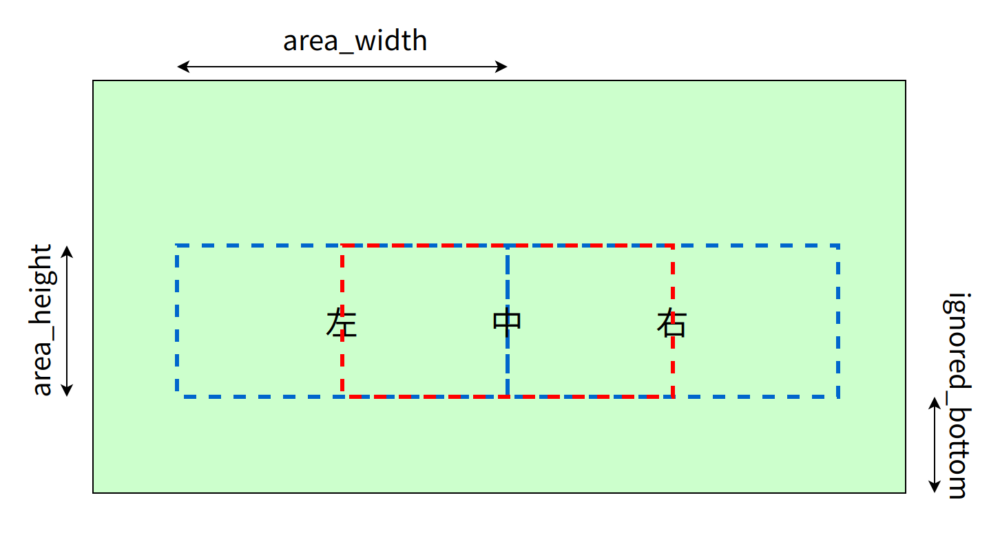
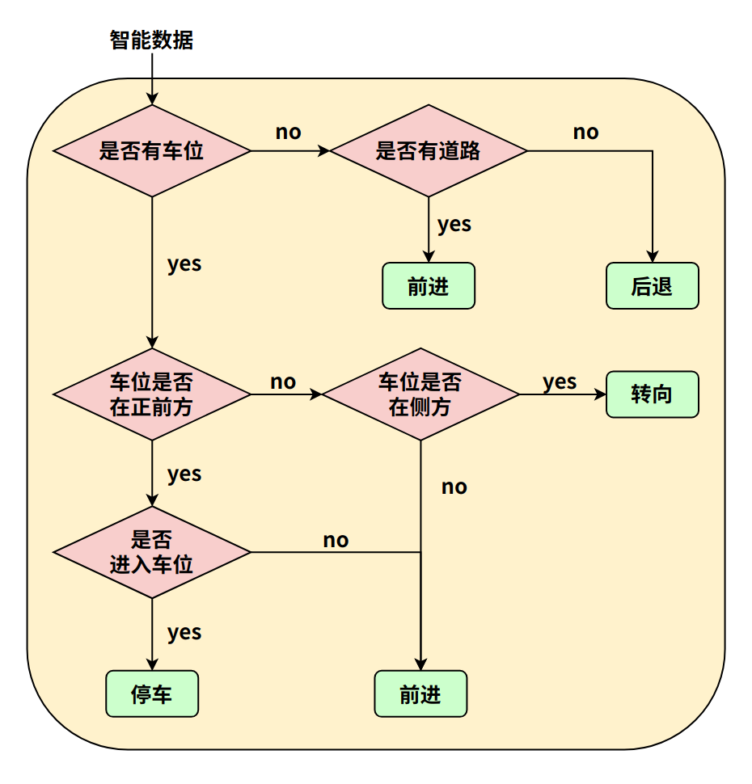
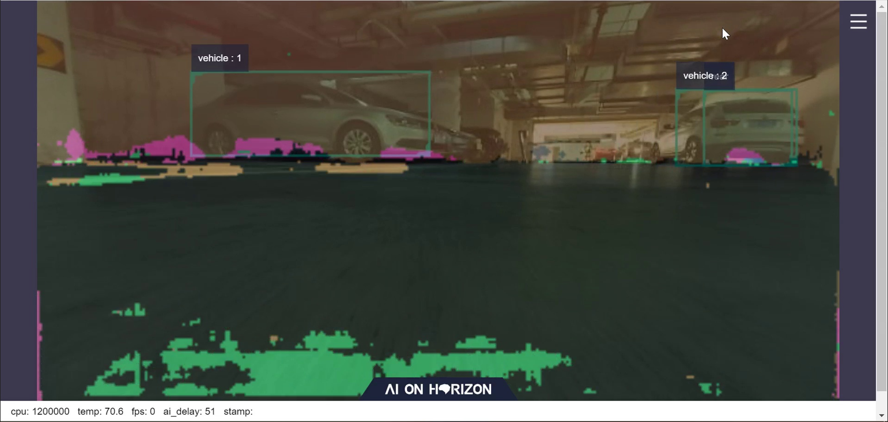

English| [简体中文](./README_cn.md)

# Function Introduction

The parking_search package functions to guide the robot to the parking space using parking detection algorithms.

Subscribe to intelligent results ai_msgs, run strategies to determine the parking space location and robot control strategies.

Control the robot's rotation and translation directly by publishing messages.

## Control Strategy

Divide the field of view into "left", "middle", and "right" areas. Calculate the IOU of parking area and driving area in each region, determine the corresponding area type based on the threshold, and judge the direction of progression. If both areas are below the threshold, adopt reversing for recalculating and judgment.

| Field of View | Left | Middle | Right |
| - | - | - | - |
| Parking Area IOU | 0.6 | 0.7 | 0.6 |
| Driving Area IOU | 0.8 | 0.9 | 0.8 |

<br/>

## Decision Priority

Parking Area > Driving Area > Other Areas

Middle Area > Right Area > Left Area

## Algorithm Flowchart

<br/>

# Compilation

## Dependencies

ROS packages:

- ai_msgs

ai_msgs is a custom message format used to publish the inference results after the algorithm model reasoning. The ai_msgs package is defined in hobot_msgs.

## Development Environment

- Programming Language: C/C++

- Development Platform: X3/X86

- System Version: Ubuntu 20.0.4

- Compilation Toolchain: Linux GCC 9.3.0/Linaro GCC 9.3.0

## **Compilation**
Supports two methods of compiling on X3 Ubuntu system and using Docker cross compilation on PC
### **Compilation on Ubuntu Board**

1. Compilation Environment Confirmation
   - The X3 Ubuntu system is installed on the board.
   - The current compilation terminal has set the TogetherROS environment variable: `source PATH/setup.bash`. Here, PATH represents the installation path of TogetherROS.
   - The ROS2 compilation tool colcon is installed with the command: `pip install -U colcon-common-extensions`
2. Compilation

Compilation command: `colcon build --packages-select parking_search`

### Docker Cross-Compilation

1. Compilation Environment Confirmation

   - Compilation in docker, with TogetherROS already installed in docker. For docker installation, cross-compilation instructions, TogetherROS compilation, and deployment instructions, refer to the README.md in the robot development platform's robot_dev_config repo.

2. Compilation

   - Compilation command:

```shell
export TARGET_ARCH=aarch64
export TARGET_TRIPLE=aarch64-linux-gnu
export CROSS_COMPILE=/usr/bin/$TARGET_TRIPLE-

colcon build --packages-select parking_search \
   --merge-install \
   --cmake-force-configure \
   --cmake-args \
   --no-warn-unused-cli \
   -DCMAKE_TOOLCHAIN_FILE=`pwd`/robot_dev_config/aarch64_toolchainfile.cmake
```

## Notes

# Usage Introduction

## Dependencies

- mipi_cam package: Publishes image msg
- hobot_codec package: JPEG image encoding & publishing
- parking_perception package: Publishes parking spot information perception results msg
- websocket package: Renders images and AI perception msg

## Parameters

| Parameter Name             | Type       | Explanation                                   | Required | Supported Configurations                                                                                | Default Value                 | Supports Runtime Dynamic Configuration |
| ------------------------- | ----------- | ---------------------------------------------- | -------- | ------------------------------------------------------------------------------------------------------- | ----------------------------- | ---------------------- |
| area_height | int | Height of each detection area | No | 0-(160-ingored_bottom) | 40 | No |
| area_width | int | Width of each detection area | No | 0-160 | 120 | No |
| ingored_bottom | int | Height to be ignored at the bottom | No | 0-(160-area_height) | 40 | No |
| mid_parking_iou | float | IOU threshold for parking area detection | No | 0-1 | 0.7 | No |
| sides_parking_iou | float | IOU threshold for driving area detection | No | 0-1 | 0.6 | No |
| mid_path_iou | float | IOU threshold for parking area detection | No | 0-1 | 0.9 | No |
| sides_path_iou | float | IOU threshold for driving area detection | No | 0-1 | 0.8 | No |
| arrived_count | int | Condition count for determining entry into parking space | No | Greater than 0 | 400 | No |
| move_step | float | Step length for translational motion, unit: meters | No | Unrestricted | 0.1 | Yes |
| rotate_step | float | Step length for rotational motion, unit: radians | No | Unrestricted | 0.1 | Yes |
| twist_pub_topic_name | std::string | Topic name for publishing Twist-type motion control messages | No | Configured based on actual deployment environment. Generally, the topic subscribed by the robot is /cmd_vel, and the topic subscribed by ROS2 turtlesim example is turtle1/cmd_vel. | /cmd_vel | No |
| ai_msg_sub_topic_name | std::string | Topic name for subscribing AI messages containing parking area results | No | Configured based on actual deployment environment | /ai_msg_parking_perception | No |

## Run

After successful compilation, copy the generated installation path to the RDK X3 development board (if compiling on X3, ignore the copying step), and execute the following commands to run:

### **Ubuntu**

```shell
export COLCON_CURRENT_PREFIX=./install
source ./install/setup.bash
# The config here is a model used for demonstration, copy it according to the actual installation path
# If compiling on the board end (without --merge-install compilation option), the copy command is cp -r install/PKG_NAME/lib/PKG_NAME/config/ ., where PKG_NAME is the specific package name.
cp -r install/lib/parking_perception/config/ .

# MIPI camera input
export CAM_TYPE=mipi

ros2 launch parking_search parking_search.launch.py
```

### **Linux**

```shell
export ROS_LOG_DIR=/userdata/
export LD_LIBRARY_PATH=${LD_LIBRARY_PATH}:./install/lib/

# The config here is a model used for demonstration, copy it according to the actual installation path
cp -r install/lib/parking_perception/config/ .

# Start the image publishing package
./install/lib/mipi_cam/mipi_cam --ros-args -p out_format:=nv12 -p image_width:=640 -p image_height:=320 -p io_method:=shared_mem --log-level error &
# Start the JPEG image encoding & publishing package
./install/lib/hobot_codec/hobot_codec_republish --ros-args -p channel:=1 -p in_mode:=shared_mem -p in_format:=nv12 -p out_mode:=ros -p out_format:=jpeg -p sub_topic:=/hbmem_img -p pub_topic:=/image_jpeg --ros-args --log-level error &
# Start the parking area detection package
./install/lib/parking_perception/parking_perception --ros-args --log-level error &
# Start the web display package
./install/lib/websocket/websocket --ros-args -p image_topic:=/image_jpeg -p image_type:=mjpeg -p smart_topic:=/ai_msg_parking_perception --log-level error &
# Start parking area search pkg
./install/lib/parking_search/parking_search
```
## Notes

1. To start the board-end using launch, dependencies need to be installed with the command: `pip3 install lark-parser`. Configuration only needs to be done once on the device, and does not need to be reconfigured after power outage restart.
2. To start the car motion pkg, the driver needs to be configured: `cp install/lib/xrrobot/config/58-xrdev.rules /etc/udev/rules.d/`, then restart the X3 development board after copying. Configuration only needs to be done once on the device, and does not need to be reconfigured after power outage restart.
3. The first time running the web display requires starting the webserver service, the method is as follows:

- cd to the deployment path of websocket: `cd install/lib/websocket/webservice/` (if compiling on the board end (without the --merge-install compilation option), execute the command `cd install/websocket/lib/websocket/webservice`)
- Start nginx: `chmod +x ./sbin/nginx && ./sbin/nginx -p .`
- Configuration needs to be redone after device restart.

# Results Analysis

## X3 Results Display

1. Log information when the car is searching forward in the driving area

```
[parking_search-4] [WARN] [1661942399.306904646] [ParkingSearchEngine]: do move, direction: 0, step: 0.100000
[parking_search-4] [WARN] [1661942399.343490021] [ParkingSearchEngine]: do move, direction: 0, step: 0.100000
[parking_perception-3] [WARN] [1661942399.347396979] [parking_perception]: input fps: 29.97, out fps: 29.67
[parking_search-4] [WARN] [1661942399.410602188] [ParkingSearchEngine]: do move, direction: 0, step: 0.100000
[parking_search-4] [WARN] [1661942399.449585563] [ParkingSearchEngine]: do move, direction: 0, step: 0.100000
```

2. Log information when the car turns after finding a parking space

```
[parking_search-4] [WARN] [1662539779.408424498] [ParkingSearchEngine]: do rotate, direction: 2, step: 0.100000
[parking_search-4] [WARN] [1662539779.442805415] [ParkingSearchEngine]: do rotate, direction: 2, step: 0.100000
[parking_search-4] [WARN] [1662539779.483669831] [ParkingSearchEngine]: do rotate, direction: 2, step: 0.100000
[parking_search-4] [WARN] [1662539779.522690915] [ParkingSearchEngine]: do rotate, direction: 2, step: 0.100000
[parking_search-4] [WARN] [1662539779.563660873] [ParkingSearchEngine]: do rotate, direction: 2, step: 0.100000
[parking_perception-3] [WARN] [1662539779.595755290] [parking_perception]: input fps: 29.87, out fps: 29.63
[parking_search-4] [WARN] [1662539779.604272498] [ParkingSearchEngine]: do rotate, direction: 2, step: 0.100000
```

3. Log information when the car moves forward and finally stops after confirming the parking space

```
[parking_search-4] [WARN] [1662539796.196264298] [ParkingSearchEngine]: do move, direction: 0, step: 0.100000
[parking_search-4] [WARN] [1662539796.227805589] [ParkingSearchEngine]: Find Target, current count: 398, target count: 400
[parking_search-4] [WARN] [1662539796.267424798] [ParkingSearchEngine]: do move, direction: 0, step: 0.100000
[parking_search-4] [WARN] [1662539796.317332964] [ParkingSearchEngine]: Find Target, current count: 399, target count: 400
[parking_search-4] [WARN] [1662539796.346787673] [ParkingSearchEngine]: do move, direction: 0, step: 0.100000
[parking_search-4] [WARN] [1662539796.386203756] [ParkingSearchEngine]: Find Target, current count: 400, target count: 400
[parking_perception-3] [WARN] [1662539796.428427089] [ParkingSearchEngine]: input fps: 29.90, out fps: 29.74
[parking_search-4] [WARN] [1662539796.465178589] [ParkingSearchEngine]: Parking Area Arrived !!!
[parking_search-4] [WARN] [1662539796.506218048] [ParkingSearchEngine]: Parking Area Arrived !!!
[parking_search-4] [WARN] [1662539796.547036881] [ParkingSearchEngine]: Parking Area Arrived !!!

```

## Web Display Effect

Detection effect in parking scenario

<br/>


# FAQs

Q1: The app functions do not meet expectations when using cameras with different resolutions.

A1: Currently, the algorithm only processes intelligent results within the 640x320 resolution for data exceeding this resolution. Therefore, it is necessary to modify the parameters of the region size (area_height, area_width, ignored_bottom) to adapt to different resolutions. It is recommended to use the default input resolution.
